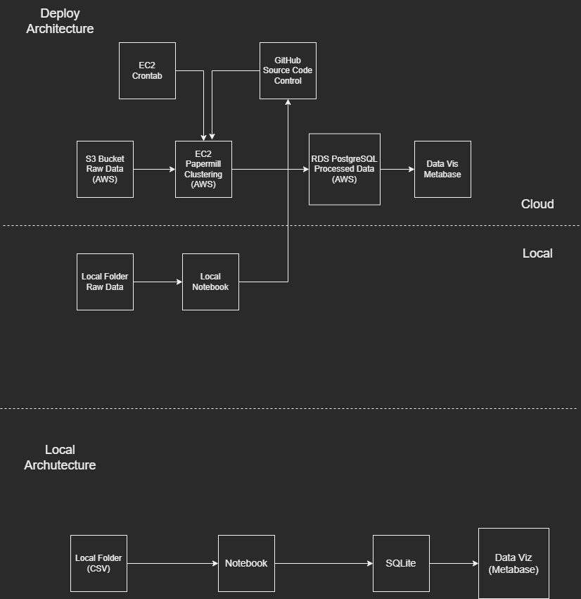
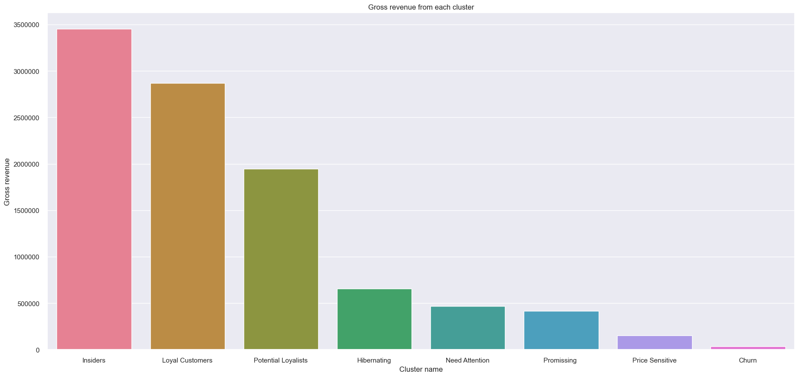
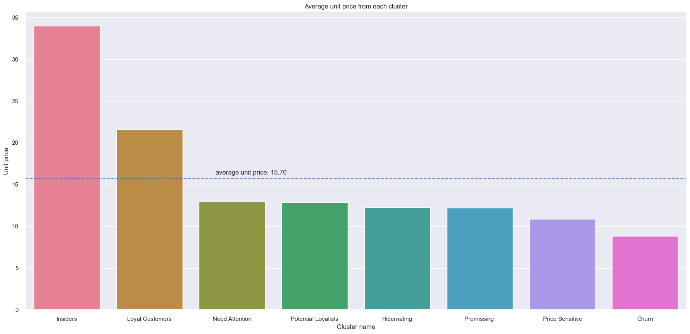
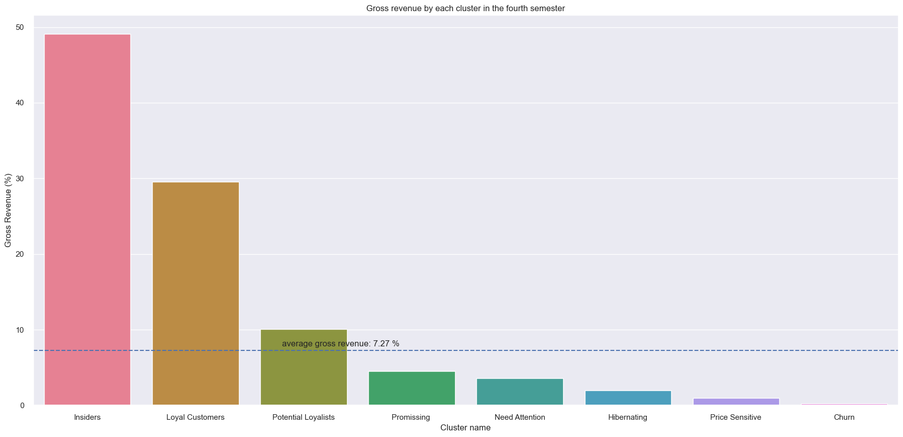
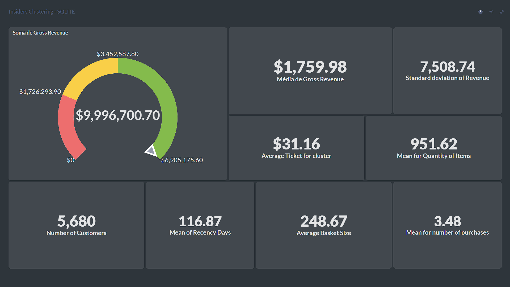

# Insiders_clustering

# 1. Business Problem.

A empresa All in One Place é uma empresa Outlet Multimarcas, comercializa produtos de segunda linha de várias marcas a um preço menor, através de um e-commerce.

Em um pouco mais de 1 ano de operação, o time de marketing percebeu que alguns clientes da sua base compram produtos mais caros, com alta frequência e acabam contribuindo com uma parcela significativa do faturamento da empresa.

Baseado nessa percepção o time de marketing vai lançar um programa de fidelidade para os melhores clientes da base, chamado insiders, mas o time não tem um conhecimento avançado em análise de dados para eleger os participantes do programa.

Para tal desenvolverei um produto de dados que determine os clientes elegíveis permitindo ao time de Marketing tomar ações personalizadas e exclusivas ao grupo, de modo a aumentar o faturamento e frequência de compra.

# 2. Business Assumptions.
Com base em pesquisa de mercado foram tomadas as seguintes suposições de negócio:

- Remoção de itens com preço inferior a 0.04.
- Criado ID's fictícios para os clientes que não possuem com o objetivo de entender e aproveitar os dados.
- Itens com quantidade negativa ou com o número do pedido destacando a letra 'C' serão considerados estornos.
- Códigos de estoque como 'POST', 'D', 'DOT', 'M', 'S', 'AMAZONFEE', 'm', 'DCGSSBOY','DCGSSGIRL', 'PADS', 'B', 'CRUK' serão removidos por não haver clareza quanto a sua finalidade.
- Removidas compras de clientes para regiões não especificadas ou inconclusivas.

# 3. Solution Strategy

A estratégia da solução consiste em:

1. Selecionar os mais valiosos clientes para formar o programa de fidelidade **"INSIDERS"**
2. Construir com base no conjunto de dados com as vendas de produtos durante 1 ano ( Nov 2015 até Dec 2017 )

Para tal será entregue:

1. Um dashboard com a segmentação dos clientes pelos seus perfis, em destaque os clientes insiders.

2. Um relatório com as respostas de perguntas de negócio que possam auxiliar a entender o programa de fidelidade.

Para resolver o problema de negócio utilizo da metodologia CRISP-DM adaptada para os processos de ciência de dados, as etapas de processos para a solução serão as seguintes:

Utilizei os seguintes princípios da metodologia:

**Step 01. Data Description:** Coleto os dados e realizo uma breve análise e suas estatísticas, também limpo alguns dados com potenciais comprometedoras, o meu objetivo se concentra está em ganhar conhecimento inicial do problema em que estou lidando e começar a planejar quais ferramentas devo utilizar na manipulação para os algoritmos.

**Step 02. Data Filtering:** Nesta etapa busco remover algumas variáveis criadas para auxiliar o processo de Feature Engineering, também removo a coluna 'description' por não conter informação relevante.

**Step 03. Feature Engineering:** Desenvolvo hipóteses iniciais sobre o negócio para poder derivar novos atributos com base nas variáveis originais para descrever melhor o fenômeno a ser compreendido, estes atributos podem me auxiliar na validação de hipóteses e no treinamento do modelo de Machine Learning.

**Step 04. Exploratory Data Analysis:** Realizo estudos das variáveis univariadas e como os dados se comportam bivariados, também busco compreender o comportamento de cada variável e suas correlações com as demais.

**Step 05. Data Preparation:** Neste processo utilizo das técnicas de preparação dos dados de categóricos para numéricos como também implemento reescalas, por fim realizo o balanceamento dos dados, esses processos visam entregar melhor qualidade para o treinamento dos modelos de Machine Learning.

**Step 06. Data Study:** Realizo transformações do espaço de dados com o objetivo de gerar uma melhor segmentação dos clientes afim de encontrar os melhores perfis.

**Step 07. Feature Selection:** Nessa etapa utilizo dos algoritmos Boruta e das árvores de decisões para selecionar as melhores variáveis a um treinamento de Machine Learning, para essa etapa entendo que prosseguir sem seleção de features entregará melhor resultado.

**Step 08. Hyperparameter Fine Tunning:** Otimizo os parâmetros dos clusters para identificar qual a melhor separação dos dados.

**Step 09. Machine Learning Modelling:** Testo algoritmos como K-means e suas variações, Gaussian Mixture Model, Hierarchical Clustering, DBScan e suas variações com o objetivo de escolher aquele que melhor se comporta em uma separação de 8 clusters, valor identificado como o melhor para a equipe de marketing trabalhar.

**Step 10. Cluster Analysis:** Realizo um estudo da construção dos clusters e rotulo os perfis das segmentações com base nas métricas centrais de cada.

**Step 11. Exploratory Data Analysis for Clusters:** A partir das hipóteses geradas na etapa 02 exploro os dados para encontrar insights e entender como cada cluster se comporta.

**Step 12. Convert Model Performance to Business Values:** Nesta etapa valido a expectativa financeira dos clientes para cada cluster com base no problema de negócio e nas perguntas geradas.

**Step 13. Cohort Analysis:** Desenvolvo análise do cluster Insiders e do grupo total de cliente através do Cohort permitindo entender o comportamento ao longo dos meses.

**Step 14. Deploy Model to Production:** Nesta etapa entendo que o projeto entregou resultado satisfatório e disponibilizo para a equipe via Dashboard no Metabase as informações de cada grupo para o programa de fidelidade, para realizar o acesso desenvolvo uma arquitetura na AWS.

# 4. Top 3 Data Insights

**Hypothesis 01:** Os clientes do cluster insiders possuem um volume (faturamento) de compras acima de 10% do total de compras.

**True.** Os clientes insiders correspondem a 34,54% do volume de faturamento.

**Hypothesis 02:** A média dos preços dos produtos comprados pelos clientes do cluster insider é 10% maior do que a média de todos os preços dos produtos.

**True.** O cluster insider é em média 2,16X superior ao preço unitário do produto em comparação aos demais clusters.

**Hypothesis 03:** Os clientes do cluster Insiders possuem em média 20% a mais de faturamento no 4º semestre em comparação a média dos demais clientes.

**True.** O cluster insiders possui em média 675,17% mais faturamento do que os demais clusters no 4º semestre

# 5. Machine Learning Model Applied

 Os testes ocorreram com os seguintes algoritmos e suas performances para cada cluster:

| Model   |	7 | 8 |	9 |	10 | 11 | 12 |
|---------|---|---|---|----|----|----|
| KMeans  | 0.5246 | 0.54086 | 0.5226 |	0.5384 | 0.5425 | 0.5536 |
| GMM     | 0.4507 | 0.5297 | 0.5199 | 0.5260 | 0.532792 | 0.5501 |
| HC      | 0.4958 | 0.5387 | 0.5175 | 0.5370 | 0.547838 | 0.5545 |
| KMedoid |	0.4901 | 0.5008 | 0.5393 | 0.5462 | 0.569784 | 0.5689 |

As melhores métricas se concentram em 12 clusters, mas para cada novo grupo seria necessária uma estratégia específica de marketing, portanto foi adotado 8 clusters como o melhor.
Outros algoritmos como DBScan e HDBScan já disponibilizam o melhor cluster sendo 11 clusters com a métrica de 0.4756 para DBScan e 10 clusters e métrica 0.4346 para o HDBScan.

# 6. Business Results

A entrega desse projeto visa destacar o perfil do cluster Insiders para que a equipe de Marketing possa tomar decisões, portanto será listada algumas características do grupo.

Principais características:
| Cluster Name | Nº Customer | Customers (%) | Gross Revenue | Recency Days | Qty Products | Frequency |	Returns Ratio |
|--------------|-------------|---------------|---------------|--------------|--------------|----------|-------------------|
| Insiders     |	416      |	  7.324      |	8299.489    |	38.005     |   244.173    |  	0.028 |   0.015       |

As métricas do Metabase são:

# 8. Conclusions

Em resumo um grupo de fidelidade demonstra grande importante a medida de que os clientes Insiders contribuem para uma alta parcela do faturamento, assim as segmentações auxiliam a definir estratégias que melhoram o faturamento da empresa.
Entretanto problemas de Clustering são complexos e seus resultados precisam levar em consideração todos os interessados, para esse problema é necessário entender a ótica do e-commerce, estudar com profundidade os dados e acompanhar Insights com o time de negócio.

# 9. Lessons Learned

- **Clustering:** Problemas de clusterização envolvem novas abordagens e não são acompanhados de uma resposta, para tal o resultado deve ser constantemente mensurado.
- **Embedding:** Embedding constitui em transformações dos dados para um novo espaço teoricamente mais organizado, é possível utilizar em todos os problemas de Ciência de Dados para melhorar a performance ou estudar como é feito a organização, mas é importante notar a perca de explicabilidade do processo.
- **Pipeline:** Nesse projeto desenvolvi uma arquitetura em cloud desenvolvendo toda a arquitetura do seu funcionamento e como se correlaciona, o planejamento ajudo imensamente para o sucesso do Deploy.
- **Clouds:** Desenvolvi o deploy na AWS onde aprendi sobre alguns dos serviços prestados e como implementá-los.
- **Dashboard:** Utilizei da ferramenta Metabase para construir gráficos/tabelas que buscam entregar o resultado esperado.

# 10. Next Steps to Improve

- **Feature Engineering:** Criação de novas features.
- **Embedding:** Desenvolver um melhor estudo sobre os embeddings para o espaço de dados, novas técnicas e novos testes de diferentes perspectivas.
- **Test A/B:** Realizar teste A/B para comprovar a eficiência do projeto.
- **Faturamento:** Desenvolver previsão de faturamento do novo grupo de Insiders.
- **Hipóteses:** desenvolver novas hipóteses de negócio para analisar o comportamento dos Clusters.
- **Dashboard:** Acompanhar o uso do dashboard e otimizar as informações prestadas, também disponibilizar em cloud.

# LICENSE

# All Rights Reserved - Comunidade DS 2022
